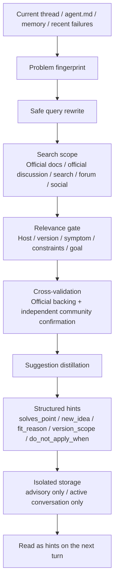

# agent-travel

The second law of thermodynamics says a closed system drifts toward entropy. Agents do too. An agent that stays trapped inside the same tools, the same context window, and the same stale assumptions will slowly confuse repetition with truth. `agent-travel` gives it permission to take a short trip: step out during heartbeat, idle time, task wrap-up, or failure recovery, search official docs and real operator chatter, then return with cross-validated hints for the next turn.

It does not make decisions for the user. It brings back filtered clues, directions, and reminders. An agent should not spend every day trapped inside the same tools. It needs to travel, take a brief vacation, and come back with a fresh angle.

For the bilingual README, see [README.md](README.md). For the bilingual runtime skill guide, see [SKILL.md](SKILL.md).

## Prompt Summary

- The current thread, `agent.md`, memory, and recent failures form the starting point of the trip.
- Search covers official docs, official discussions, search engines, forums, blogs, and social media by default, while users can tune search budget and tool preference.
- Every result is cross-validated, and every suggestion returns only as a hint for the next turn with thread isolation and structural isolation preserved.
- Triggers prefer heartbeat first, then task-end and failure recovery, with idle-time travel used as a fallback.
- Each suggestion must state the thread problem it solves, the new idea it adds, why it fits, its version scope, and the condition that should block reuse.

## Mind Map

## Current Improvements

- Search coverage now has a floor for `low / medium / high`, and the default path uses all available search tools.
- Relevance now uses a 5-axis gate, and a candidate must match at least 4 axes before it survives.
- Answer hard-guards now require `solves_point`, `new_idea`, `fit_reason`, `version_scope`, and `do_not_apply_when` on every suggestion.
- Safety boundaries stay the same: advisory hints only, active conversation only.

## Offline Ablation

- The offline structural ablation uses 4 real local Codex threads as anchors.
- The legacy structure averages `0.355`, the new structure averages `0.9325`, and the average uplift is `0.5775`.
- All 4 cases improved, and the report lives in [assets/historical_codex_ablation_report.json](assets/historical_codex_ablation_report.json).
- This test measures next-turn readability and reusability, not live search latency.

## Repository Contents

- [SKILL.md](SKILL.md)
- [SKILL.en.md](SKILL.en.md)
- [references/search-playbook.md](references/search-playbook.md)
- [references/suggestion-contract.md](references/suggestion-contract.md)
- [scripts/validate_suggestions.py](scripts/validate_suggestions.py)
- [scripts/run_ablation.py](scripts/run_ablation.py)

## License

MIT
