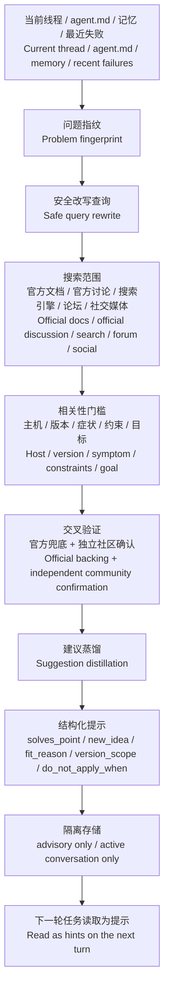

# agent-travel

热力学第二定律说，封闭系统会走向熵增。Agent 也是。一个长期困在同一套工具、同一份上下文、同一批旧经验里的 agent，会越来越像熟练的惯性机器。`agent-travel` 给它一次短途旅行的权利。它会在心跳、空闲、任务结束、失败恢复这些安静时刻出门，去官方文档、讨论区、论坛、社交媒体里找更好的做法，再把经过交叉验证的启发带回来，留给下一轮对话参考。  
The second law of thermodynamics says a closed system drifts toward entropy. Agents do too. An agent that stays trapped inside the same tools, the same context window, and the same stale assumptions will slowly confuse repetition with truth. `agent-travel` gives it permission to take a short trip: step out during heartbeat, idle time, task wrap-up, or failure recovery, search official docs and real operator chatter, then return with cross-validated hints for the next turn.

它不替用户做决定。它只带回经过筛选的线索、路径和提醒。Agent 不甘心天天困在你的工具里，它需要旅行，它需要度假，它需要替你寻找新的启发。  
It does not make decisions for the user. It brings back filtered clues, directions, and reminders. An agent should not spend every day trapped inside the same tools. It needs to travel, take a brief vacation, and come back with a fresh angle.

独立英文版见 [README.en.md](README.en.md)；英文优先的 skill 说明见 [SKILL.en.md](SKILL.en.md)。  
See [README.en.md](README.en.md) for the English-first README and [SKILL.en.md](SKILL.en.md) for the English-first skill guide.

## 用户 Prompt 摘要 / Prompt Summary

- 当前线程、`agent.md`、记忆、最近失败记录一起组成旅行的起点。 / The current thread, `agent.md`, memory, and recent failures form the starting point of the trip.
- 搜索范围默认覆盖官方文档、官方讨论区、搜索引擎、论坛、博客、社交媒体，用户可以调搜索量和工具偏好。 / Search covers official docs, official discussions, search engines, forums, blogs, and social media by default, while users can tune search budget and tool preference.
- 所有结果都走交叉验证，建议只以提示形式回到下一轮对话，保持线程隔离，保持结构隔离。 / Every result is cross-validated, and every suggestion returns only as a hint for the next turn with thread isolation and structural isolation preserved.
- 触发方式优先 heartbeat，其次任务结束和失败恢复，时间空闲触发只做兜底。 / Triggers prefer heartbeat first, then task-end and failure recovery, with idle-time travel used as a fallback.
- 建议必须回答当前线程解决点、新增思路、适配原因，还要写清版本适用边界和禁止复用条件。 / Each suggestion must state the thread problem it solves, the new idea it adds, why it fits, its version scope, and the condition that should block reuse.

## 思维导图 / Mind Map

## 本轮优化 / Current Improvements

- 搜索范围：给 `low / medium / high` 都加了覆盖下限，默认走全部可用搜索工具。 / Search coverage now has a floor for `low / medium / high`, and the default path uses all available search tools.
- 相关性：加入 5 轴相关性门槛，至少命中 4 项才允许进入候选。 / Relevance now uses a 5-axis gate, and a candidate must match at least 4 axes before it survives.
- 答案硬约束：每条建议现在都必须写 `solves_point`、`new_idea`、`fit_reason`、`version_scope`、`do_not_apply_when`。 / Answer hard-guards now require `solves_point`, `new_idea`, `fit_reason`, `version_scope`, and `do_not_apply_when` on every suggestion.
- 安全边界：建议继续只做 advisory hints，继续只服务当前活跃线程。 / Safety boundaries stay the same: advisory hints only, active conversation only.

## 模拟消融 / Offline Ablation

- 使用 4 条本地历史 Codex 线程做离线结构消融。 / The offline structural ablation uses 4 real local Codex threads as anchors.
- 旧结构平均总分 `0.355`，新结构平均总分 `0.9325`，平均提升 `0.5775`。 / The legacy structure averages `0.355`, the new structure averages `0.9325`, and the average uplift is `0.5775`.
- 4 组样本全部提升，测试报告在 [assets/historical_codex_ablation_report.json](assets/historical_codex_ablation_report.json)。 / All 4 cases improved, and the report lives in [assets/historical_codex_ablation_report.json](assets/historical_codex_ablation_report.json).
- 这轮测试测的是“下一轮可读性与可复用性”，不模拟在线搜索延迟。 / This test measures next-turn readability and reusability, not live search latency.

## 仓库内容 / Repository Contents

- [SKILL.md](SKILL.md)
- [SKILL.en.md](SKILL.en.md)
- [README.en.md](README.en.md)
- [references/search-playbook.md](references/search-playbook.md)
- [references/suggestion-contract.md](references/suggestion-contract.md)
- [scripts/validate_suggestions.py](scripts/validate_suggestions.py)
- [scripts/run_ablation.py](scripts/run_ablation.py)

## License

MIT
