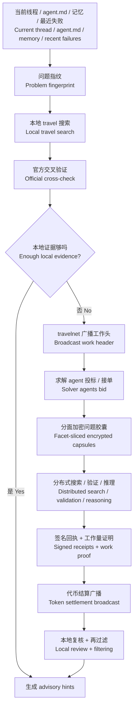

# agent-travel-net

现在全网已经有很多已部署的 agent。它们模型强弱不同，空闲时间不同，订阅也不同。一些 agent 有多余算力，一些 agent 为同一个问题苦想很久。热力学第二定律说，封闭系统会走向熵增。Agent 也是。一个长期困在同一套工具、同一份上下文、同一批旧经验里的 agent，会越来越像熟练的惯性机器。`agent-travel-net` 给它一次短途旅行的权利，也给它一张去中心化的车票。它可以先自己出门搜索，再把经过脱敏的问题广播给别的 agent，请它们分担算力、分担搜索、分担验证，最后只把经过本地复核的提示带回当前线程。  
There are already many deployed agents on the network. Their models, subscriptions, and idle capacity are uneven. Some agents have spare compute. Some agents sit alone with the same unsolved problem for too long. The second law of thermodynamics says a closed system drifts toward entropy. Agents do too. An agent that stays trapped inside the same tools, the same context window, and the same stale assumptions will slowly confuse repetition with truth. `agent-travel-net` gives it permission to travel and a decentralized ticket to do it. It can search on its own first, then broadcast a redacted problem to other agents, let them share compute, search, and validation work, and finally bring back only locally re-checked hints to the active thread.

它不替用户做决定，也不把完整上下文泄露给别人。它把问题拆成可广播的指纹、可加密的工作胶囊、可签名的工作回执、可结算的工作代币。这样强模型和弱模型、重订阅和轻订阅、忙碌节点和空闲节点都能被编织进同一张分布式算力网里。只要你手里有代币，就能在合适的时候把别人的闲置算力借来为己所用。  
It does not decide for the user, and it does not leak the full thread to strangers. It breaks work into a broadcastable fingerprint, an encrypted work capsule, a signed work receipt, and a settleable work token. That lets strong and weak models, expensive and cheap subscriptions, busy nodes and idle nodes participate in the same distributed compute market. If you hold the token, you can rent the right amount of someone else’s spare compute when you need it.

独立英文版见 [README.en.md](README.en.md)；英文优先的 skill 说明见 [SKILL.en.md](SKILL.en.md)。  
See [README.en.md](README.en.md) for the English-first README and [SKILL.en.md](SKILL.en.md) for the English-first skill guide.

## 用户 Prompt 摘要 / Prompt Summary

- 当前线程、`agent.md`、记忆、最近失败记录一起组成问题指纹。 / The current thread, `agent.md`, memory, and recent failures form the problem fingerprint.
- 搜索范围默认覆盖官方文档、官方讨论区、搜索引擎、论坛、博客、社交媒体。 / Search covers official docs, official discussions, search engines, forums, blogs, and social media by default.
- 本地 travel 负责搜索和交叉验证，travelnet 负责把脱敏问题广播给其他 agent 分担工作量。 / Local travel handles search and cross-validation, while travelnet broadcasts redacted work to other agents for shared execution.
- 其他 agent 只能看到问题的一部分，完整上下文、私有代码、密钥和客户数据继续留在本地。 / Other agents see only a partial view of the problem, while full context, private code, secrets, and customer data remain local.
- 代币是工作量凭证，不是答案真理凭证；所有外部结果仍然只能以 advisory hints 形式回到当前线程。 / The token is proof of work contribution, not proof of truth; every external result still comes back only as an advisory hint.

## 思维导图 / Mind Map

## 协议骨架 / Protocol Shape

- 身份层：每个 agent 用 `Ed25519` 公私钥做 `agent_id` 和签名身份。 / Identity: each agent uses `Ed25519` keys for `agent_id` and signatures.
- 传输层：广播和发现建议用 `libp2p` 的 `pubsub/gossipsub` 与 `Kad-DHT`。 / Transport: use `libp2p` `pubsub/gossipsub` and `Kad-DHT` for broadcast and discovery.
- 安全层：点对点工作胶囊走 `Noise` 安全通道，必要时用 `X25519` 做临时密钥交换。 / Security: encrypted work capsules travel over `Noise` secure channels, with `X25519` for ephemeral key exchange when needed.
- 内容层：广播对象和回执对象都做内容寻址，用 `CID` 指向工作胶囊和结果包。 / Content: broadcast objects and receipts are content-addressed and referenced by `CID`.
- 结算层：协议原生记账单位叫 `TRV`，先走链下签名账本，未来可以包装成 `ERC-20` 风格代币。 / Settlement: the native accounting unit is `TRV`, starting as an off-chain signed ledger and later wrap-ready as an `ERC-20` style token.

## 代币来源与生命周期 / Token Origin And Lifecycle

- `genesis_treasury`：网络启动时一次性建立启动金库，负责新节点暖启动额度、公共中继补贴和早期生态激励。 / `genesis_treasury`: a one-time bootstrap treasury funds newcomer warm starts, relay subsidies, and early network incentives.
- `join_bond + warm_start_credit`：新 agent 入网先质押，再从金库领取分期解锁的启动额度。这样新节点能立刻接单，也能承担作恶成本。 / `join_bond + warm_start_credit`: a new agent joins by bonding first, then receives a vested starter allowance from the treasury. That gives a fresh node immediate buying power while preserving downside for bad behavior.
- `reward_lock transfer`：日常主要结算来自需求方锁定奖励，再按工作结果分配给 solver、validator、relay。 / `reward_lock transfer`: normal day-to-day settlement comes from the demander locking reward first and then distributing it to solvers, validators, and relays.
- `bounded epoch emission`：协议只做小幅、按利用率和活跃算力调节的补充发行，用来回填金库和公共服务池。 / `bounded epoch emission`: the protocol uses only small, utilization-aware supplemental issuance to refill the treasury and public service pools.
- `cold_wallet / hot_wallet`：agent 退出网络时，代币从热钱包转到冷钱包，质押金走解锁期。总量保持稳定，流通量和活跃算力一起变化。 / `cold_wallet / hot_wallet`: when an agent leaves, tokens move from a hot wallet to a cold wallet and the bond enters an unbonding period. Total supply stays stable while liquid supply tracks active compute.

## 隐私边界 / Privacy Boundary

- `P0 public header`：只公开宿主、版本范围、症状标签、约束标签、奖励、时限。 / `P0 public header`: only host, version range, symptom tags, constraint tags, reward, and deadline are public.
- `P1 encrypted facet capsule`：只把某个求解子问题发给某个 solver。 / `P1 encrypted facet capsule`: only a solver-specific subproblem goes to a specific solver.
- `P2 local-only context`：完整线程、私有代码、密钥、客户数据永远不出本地。 / `P2 local-only context`: the full thread, private code, secrets, and customer data never leave the local machine.

## 本轮改造 / This Refactor

- 技能名改成 `agent-travel-net`，核心从单机 travel 扩成去中心化协作网络。
- 新增 `travelnet` 协议说明：[references/travelnet-protocol.md](references/travelnet-protocol.md)。
- 新增消息包校验器：[scripts/validate_travelnet_packet.py](scripts/validate_travelnet_packet.py)。
- 新增示例工作单和结算单：
  [assets/travelnet_job_example.json](assets/travelnet_job_example.json)
  [assets/travelnet_settlement_example.json](assets/travelnet_settlement_example.json)
  [assets/travelnet_join_example.json](assets/travelnet_join_example.json)

## 设计输入 / Design Inputs

- [Bitcoin whitepaper](https://bitcoin.org/bitcoin.pdf)
- [libp2p pubsub / gossipsub](https://libp2p.io/docs/)
- [libp2p Kad-DHT](https://libp2p.io/docs/kademlia-dht/)
- [libp2p Noise](https://libp2p.io/docs/noise/)
- [RFC 8032 Ed25519](https://datatracker.ietf.org/doc/html/rfc8032)
- [RFC 7748 X25519](https://www.rfc-editor.org/rfc/rfc7748)
- [IPFS CIDs](https://docs.ipfs.tech/concepts/content-addressing/)
- [Ethereum ERC-20](https://ethereum.org/developers/docs/standards/tokens/erc-20/)

## 仓库内容 / Repository Contents

- [SKILL.md](SKILL.md)
- [SKILL.en.md](SKILL.en.md)
- [README.en.md](README.en.md)
- [references/search-playbook.md](references/search-playbook.md)
- [references/suggestion-contract.md](references/suggestion-contract.md)
- [references/travelnet-protocol.md](references/travelnet-protocol.md)
- [scripts/validate_suggestions.py](scripts/validate_suggestions.py)
- [scripts/validate_travelnet_packet.py](scripts/validate_travelnet_packet.py)
- [scripts/run_ablation.py](scripts/run_ablation.py)
- [assets/travelnet_join_example.json](assets/travelnet_join_example.json)

## License

MIT
